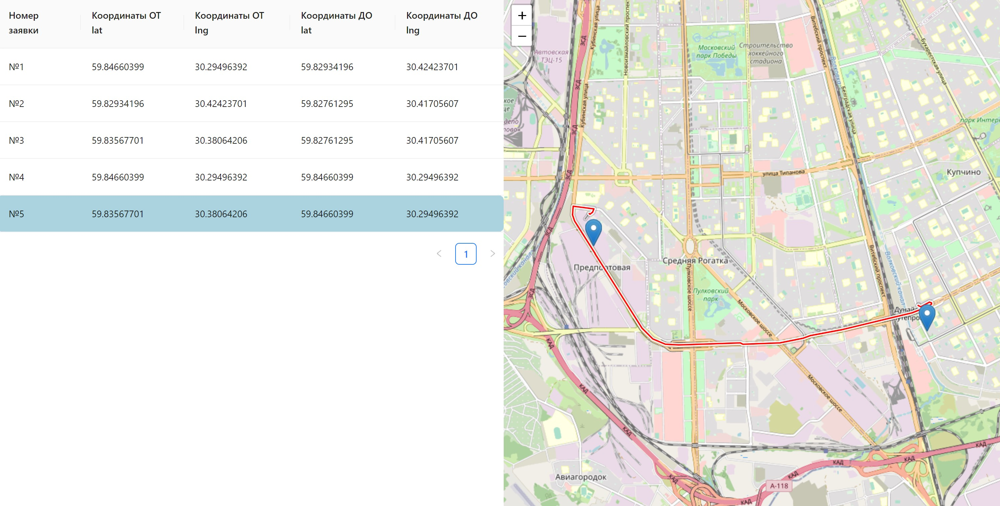

In progress...

# Mapping App

React + Redux + Redux Saga + Leaflet + Leaflet routing machine

## Technology stack

## Result

## Author

Anna Pushkareva 
[@AnnaPushka](https://github.com/annapushka)
